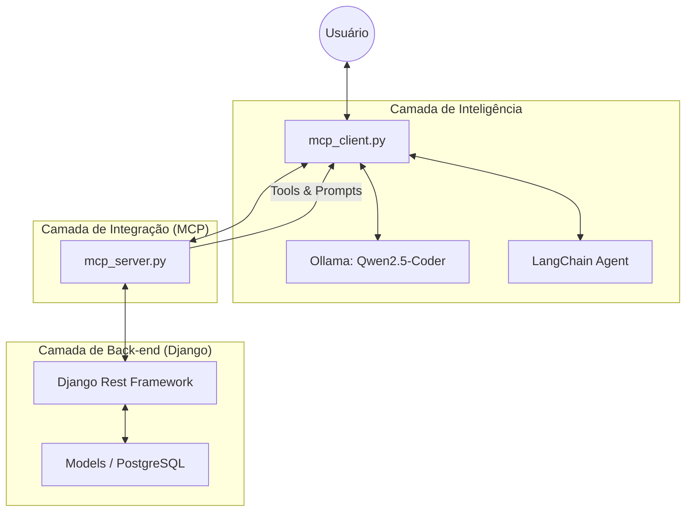

# Aprendizado: FastMCP + LangChain (Django/PostgreSQL)

Este documento explica os conceitos fundamentais do projeto, focando na integração entre o **FastMCP** e o **LangChain** para gerenciar tarefas no Django.

## 🗺️ Mapa Mental: Arquitetura

## Componentes Principais

### 1. O Servidor: `mcp_server.py` (FastMCP)

O servidor MCP é o que conecta a Inteligência Artificial ao seu código.

- **Tools (`@mcp.tool`)**: São as ações (ex: `list_tasks`).
- **Prompts (`@mcp.prompt`)**: São templates de conversa.

### 2. O Cliente: `mcp_client.py` (LangChain)

Este arquivo utiliza o **LangChain** para orquestrar as ferramentas do servidor.

- **Agente ReAct**: Utiliza o padrão Thought -> Action -> Observation.
- **Integração**: Transforma automaticamente as ferramentas do MCP em ferramentas do LangChain.

### 3. O Back-end: Django + PostgreSQL

- **Models**: Define a estrutura das tarefas.
- **DRF**: Expõe a API que o servidor MCP consome via HTTP.
- **Docker**: Mantém o banco de dados PostgreSQL rodando.

### 4. O Cérebro da Integração: `DRFMCPRegistry` 🧠⚖️

Este é o componente mais avançado do projeto. Ele elimina a necessidade de registrar ferramentas manualmente:

- **Introspecção de Serializers**: Ele lê os Serializers do DRF para descobrir quais campos são obrigatórios (`required=True`). Isso gera ferramentas no MCP que forçam a IA a pedir os dados necessários (ex: `description`).
- **Mapeamento de Rotas**: Utiliza o `router.get_routes()` do Django para mapear URLs reais, convertendo automaticamente regex complexas em variáveis legíveis para o MCP (como `{pk}`).
- **Filtros e Paginação**: Identifica automaticamente se a ViewSet suporta `search_fields` ou `ordering_fields` e expõe esses parâmetros como argumentos opcionais para a IA.
- **Segurança Partial (PATCH)**: Sabe diferenciar uma criação de uma atualização parcial, tornando campos opcionais no `PATCH` mesmo que sejam obrigatórios no banco.

## 🔄 Fluxo de Funcionamento

1. O **Usuário** pede algo.
2. O **Agente (LlamaIndex)** orquestra a chamada.
3. O **Servidor MCP** (via Registry) expõe a ferramenta com a assinatura exata.
4. O **Django** processa a lógica de negócio e persiste no **PostgreSQL**.
5. O resultado volta formatado em JSON para a IA responder.

---

**💡 Dica:** O Model Context Protocol (MCP) garante que seu back-end seja agnóstico à IA. Você pode trocar o cliente por qualquer outro orquestrador, e o seu servidor de dados continuará funcionando! 🚀🍿
