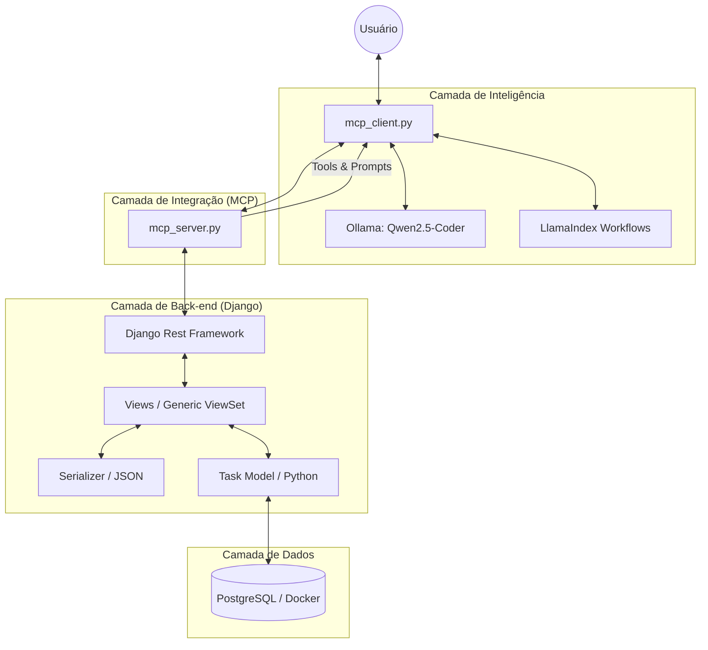
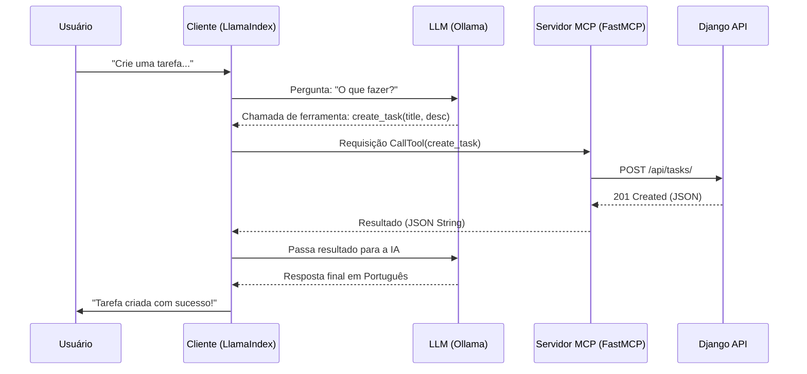

# Aprendizado: Entendendo o Back-end e MCP (PostgreSQL Version)

Este documento explica os conceitos fundamentais do projeto, detalhando o papel de cada tecnologia e arquivo para facilitar o seu aprendizado.

## 🗺️ Mapa Mental: Arquitetura Geral

## 🔄 Fluxo MCP: LLM <-> Servidor

---

## 1. O "Cérebro" do Projeto: `mcp_project/settings.py`

Este arquivo centraliza todas as configurações da aplicação.

- **INSTALLED_APPS**: Onde registramos o Django Rest Framework (`rest_framework`) e o nosso app (`core`). No PostgreSQL, podemos usar todos os apps padrão do Django como `admin` e `auth` sem problemas.
- **DATABASES**: Configuramos o motor do PostgreSQL (`django.db.backends.postgresql`). Ele exige um nome de banco, usuário e senha que coincidem com o nosso `docker-compose.yml`.

## 2. A Estrutura dos Dados: `core/models.py`

O **Model** define a "forma" dos seus dados.

- Criamos a classe `Task`. No Django, você não cria tabelas no banco de dados manualmente; você define uma classe em Python e o Django gera a estrutura necessária (SQL) para você através das **Migrations**.
- **Validação de Negócio**: Removemos o `blank=True` da descrição, tornando o campo obrigatório no nível do banco e da API.

## 3. O Tradutor: `core/serializers.py` (DRF)

Este é um componente específico do Django Rest Framework.

- O Serializador transforma objetos complexos do Python em **JSON**. No PostgreSQL, como usamos IDs numéricos padrão, a serialização é automática e muito simples.

## 4. A Lógica de Negócio: `core/views.py`

Aqui decidimos o que acontece quando alguém acessa sua API.

- Usamos o `ModelViewSet`. Ele é uma ferramenta poderosa que já traz pronto o código para as 4 operações básicas: Criar, Ler, Atualizar e Deletar (CRUD).

## 5. A Praticidade do Docker: `docker-compose.yml`

O **Docker** permite que você rode softwares (como o PostgreSQL) dentro de "containers" isolados. Facilita a configuração do ambiente, garantindo que o banco de dados esteja sempre pronto para uso.

## 6. A Integração: `mcp_server.py` (FastMCP)

O servidor MCP é o que conecta a Inteligência Artificial ao seu código.

- **Tools (`@mcp.tool`)**: São ações que a IA pode realizar (ex: `list_tasks`, `create_task`).
- **Prompts (`@mcp.prompt`)**: São templates de conversa ou sugestões que o servidor fornece para a IA. Isso garante que a IA responda sempre no formato que você deseja ou tenha "ideias" pré-configuradas.

## 7. O Cliente Inteligente: `mcp_client.py` (LlamaIndex)

Este arquivo conecta o modelo local (Ollama) ao protocolo MCP.

- **Carga de Ferramentas**: Ele lê as ferramentas e prompts do servidor e os converte em comandos que a IA entende.
- **Segurança de Dados**: Implementamos uma lógica que impede a IA de "inventar" descrições para campos obrigatórios, fazendo-a perguntar ao usuário em vez disso.

---

## Fluxo de Funcionamento (Passo a Passo):

1. **Você** pede: "Me sugira uma tarefa sobre Python".
2. A **IA** consulta a ferramenta `obter_prompt_sugestao_tarefa` no **Servidor MCP**.
3. O **Servidor MCP** retorna o template de sugestão.
4. A **IA** gera a resposta criativa para você.
5. Se você aceitar, ela usa a ferramenta `create_task` para salvar no **Django/PostgreSQL**.

---

**💡 Dica de Estudo:** O Model Context Protocol (MCP) é uma linguagem universal. Se você mudar a sua IA do Ollama para o GPT-4, o `mcp_server.py` continuará funcionando exatamente da mesma forma! 🚀🍿
