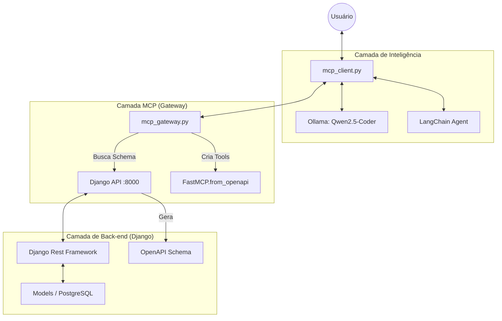

# Aprendizado: FastMCP + OpenAPI + LangChain

Este documento explica a arquitetura moderna do projeto, focando na integração **OpenAPI → MCP → LangChain**.

## 🗺️ Arquitetura Desacoplada

## Componentes Principais

### 1. Django API (Backend)

- **Models**: Define a estrutura das tarefas
- **DRF**: Expõe endpoints REST
- **drf-spectacular**: Gera automaticamente o schema OpenAPI
- **Endpoints**:
  - `/api/schema/` - Schema JSON
  - `/api/schema/swagger-ui/` - Interface de testes

### 2. MCP Gateway (`mcp_gateway.py`)

Este é o **coração da integração**. Ele:

- **Busca o schema OpenAPI** do Django na inicialização
- **Usa `FastMCP.from_openapi()`** para criar ferramentas automaticamente
- **Roda independentemente** (pode ser dockerizado)
- **Expõe via HTTP (streamable-http)** para clientes MCP

**Vantagens:**

- Zero configuração manual
- Qualquer mudança no Django é refletida automaticamente
- Compatível com qualquer API que tenha OpenAPI

### 3. Cliente LangChain (`mcp_client.py`)

- **Conecta via HTTP** ao Gateway MCP (usa `langchain-mcp-adapters`)
- **Transporte Oficial**: Usa `MultiServerMCPClient`
- **Agente LangChain**: Usa API oficial `create_agent` (v0.3+)
- **LLM Local**: Ollama com Qwen2.5-Coder

## 🔄 Fluxo de Funcionamento

1. **Usuário** faz uma pergunta
2. **Agente LangChain** analisa e decide qual ferramenta usar
3. **Cliente MCP** chama a ferramenta via HTTP
4. **Gateway MCP** traduz para uma requisição HTTP à API Django
5. **Django** processa e retorna JSON
6. **Resposta** volta pelo mesmo caminho até o usuário

## 🎯 Por Que OpenAPI?

### Antes (Introspecção Manual)

- Código customizado para ler ViewSets
- Manutenção complexa
- Acoplado ao Django

### Agora (OpenAPI)

- Padrão da indústria
- Funciona com qualquer API
- Gateway totalmente independente
- Fácil de escalar e dockerizar

## 🔑 Conceitos-Chave

### Model Context Protocol (MCP)

Protocolo que permite LLMs interagirem com sistemas externos de forma padronizada.

### OpenAPI

Especificação que descreve APIs REST de forma legível por máquinas.

### FastMCP.from_openapi()

Método do FastMCP que converte automaticamente endpoints OpenAPI em ferramentas MCP.

---

**💡 Dica:** Esta arquitetura permite que você troque o Django por **qualquer API** que tenha OpenAPI (FastAPI, Express, etc.) sem mudar o cliente! 🚀
